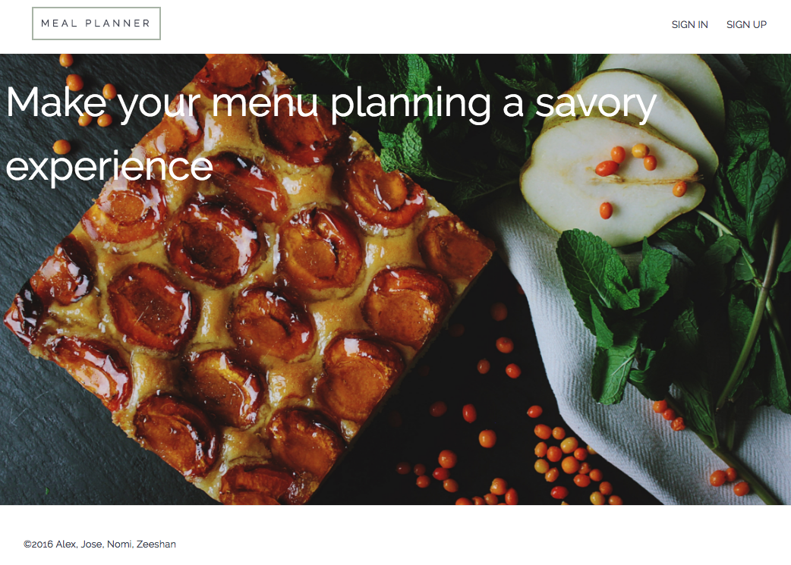
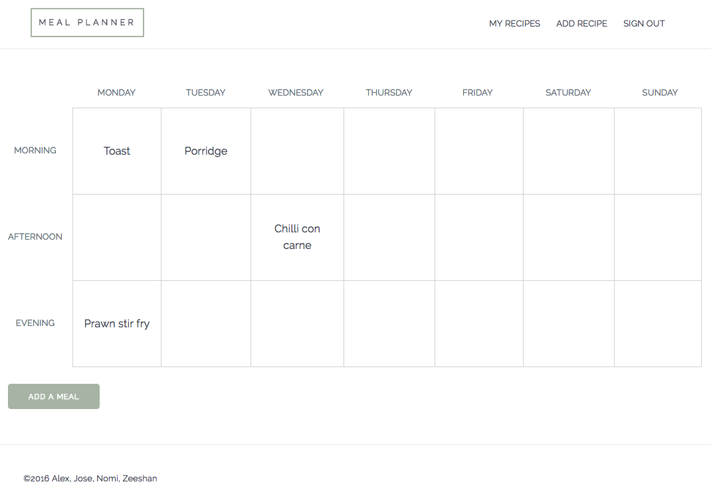

# Meal Planner

### Objectives of project

Makers Academy final group project to experience designing and implementing an MVP as part of a group over a 10 day period. The app was inspired by recipe websites and meal planners that allow users to plan out a weeks worth of meals and save recipes to their profiles.

### Wire Frames

Available on on [sketchboard.me](https://sketchboard.me/Tz56SucjbzsU#/)

### Technologies used

- Rails
- Javascript
- PostgreSQL
- Rspec
- Capybara
- SCSS (Milligram)
- HTML

### How to run it

Clone repo to a local directory:

``git clone git@github.com:joseck0510/meal_planner.git``

Create database structures and migrate database

``rake db:create``
``rake db:migrate``

Run rails server:

``bin/rails s``

Navigate to:

``localhost:3000``

Alternatively the app is deployed to [Heroku](https://meal-planner-ma.herokuapp.com/)
